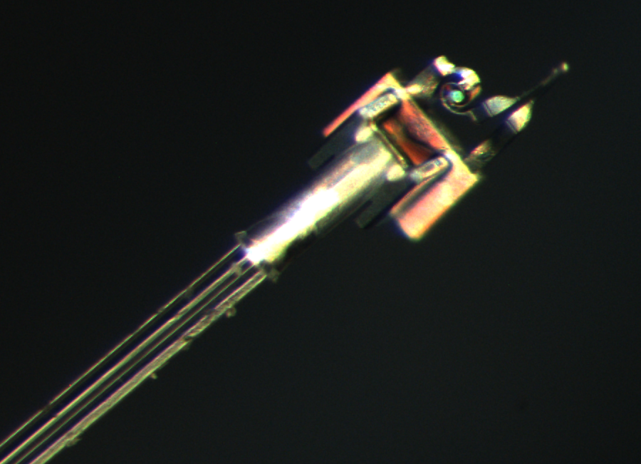

```{=html}
<div class="pub-card">
  <div class="pub-number">
    1<br>
    <a href="https://ieeexplore.ieee.org/abstract/document/10918824" target="_blank">paper URL ↗</a>
  </div>

  <div class="pub-info">
    <h3>Multi-DoF optothermal microgripper for micromanipulation applications</h3>
    <p class="authors">K. Chen, A. J. Thompson, and B. Ahmad</p>
    <p class="journal"><em>IEEE Robotics and Automation Letters</em>, vol. 10, no. 4, pp. 4061–4068, 2025.</p>
  </div>

  <div class="pub-image">
    
  </div>
</div>

<div class="pub-card">
  <div class="pub-number">
    1<br>
    <a href="https://ieeexplore.ieee.org/abstract/document/10818570" target="_blank">paper URL ↗</a>
  </div>

  <div class="pub-info">
    <h3>6-DoF motion capture with nanometric resolutions over millimetric ranges using a pseudo-periodic encoded pattern</h3>
    <p class="authors">B. Ahmad, P. Sandoz, and G. J. Laurent</p>
    <p class="journal"><em>IEEE Transactions on Instrumentation and Measurement</em>, vol. 74, no. 4, pp. 1–13, 2025.</p>
  </div>

  <div class="pub-image">
    
  </div>
</div>

<div class="pub-card">
  <div class="pub-number">
    1<br>
    <a href="https://jeos.edpsciences.org/articles/jeos/full_html/2024/02/jeos20240015/F2.html" target="_blank">paper URL ↗</a>
  </div>

  <div class="pub-info">
    <h3>Digital holographic microscopy applied to 3D computer micro-vision by using deep neural networks</h3>
    <p class="authors">S. Cuenat, J. E. B. Carcaño, B. Ahmad, P. Sandoz, R. Couturier, G. J. Laurent, and M. Jacquot</p>
    <p class="journal"><em>Journal of the European Optical Society-Rapid Publications</em>, vol. 20, no. 2, pp. 31–35, 2024.</p>
  </div>

  <div class="pub-image">
    
  </div>
</div>

<div class="pub-card">
  <div class="pub-number">
    1<br>
    <a href="https://ieeexplore.ieee.org/abstract/document/10036018" target="_blank">paper URL ↗</a>
  </div>

  <div class="pub-info">
    <h3>Hybrid optothermal-magnetic mobile microgripper for in-liquid micromanipulation</h3>
    <p class="authors">B. Ahmad, A. Barbot, G. Ulliac, and A. Bolopion</p>
    <p class="journal"><em>IEEE Robotics and Automation Letters</em>, vol. 8, no. 3, pp. 1675–1682, 2023.</p>
  </div>

  <div class="pub-image">
    
  </div>
</div>

```

# Peer-Reviewed Journal Papers

1. **K. Chen, A. J. Thompson, and B. Ahmad**  
   “Multi-DoF optothermal microgripper for micromanipulation applications”  
   *IEEE Robotics and Automation Letters*, vol. 10, no. 4, pp. 4061–4068, 2025.  
   *(Selected by IROS 2025 Program Committee for conference presentation)*
2. 
3. 
4. 
5. **B. Ahmad, A. Barbot, G. Ulliac, and A. Bolopion**  
   “Remotely actuated optothermal robotic microjoints based on spiral bimaterial design”  
   *IEEE/ASME Transactions on Mechatronics*, vol. 27, no. 5, pp. 4090–4100, 2022.
6. **B. Ahmad*, H. Chambon*, P. Tissier*, and A. Bolopion**  
   “Laser actuated microgripper using optimized chevron-shaped actuator”  
   *Micromachines*, vol. 12, no. 12, p. 1487, 2021.  
   *(*Equal first author)*
7. **B. Ahmad, M. Gauthier, G. J. Laurent, and A. Bolopion**  
   “Mobile microrobots for in vitro biomedical applications: a survey”  
   *IEEE Transactions on Robotics*, vol. 38, no. 1, pp. 646–663, 2021.
8. **B. Ahmad, H. Maeda, and T. Kawahara**  
   “Dynamic response of swimming Paramecium induced by local stimulation using a threadlike-microtool”  
   *IEEE Robotics and Automation Letters*, vol. 5, no. 2, pp. 2570–2577, 2020.  
   *(Selected by ICRA 2020 Program Committee for conference presentation)*
9. **W. Huang, S. Zhang, B. Ahmad, and T. Kawahara**  
   “Three-motorized-stage cyclic stretching system for cell monitoring based on chamber local displacement waveform”  
   *Applied Sciences*, vol. 9, no. 8, p. 1560, 2019.
10. **B. Ahmad, H. Maeda, T. Kawahara, and F. Arai**  
    “Microrobotic platform for single motile microorganism investigation”  
    *Micromachines*, vol. 8, no. 10, p. 295, 2017.  
    *(Selected as cover page of the issue)*

---

# Peer-Reviewed Full Conference Papers

1. **B. Ahmad, H. Maeda, T. Kawahara, and F. Arai**  
   “Fine positioning of micro-tubular-tools for investigating the stimulus response of swimming Paramecium”  
   *IEEE RAS/EMBS International Conference on Biomedical Robotics and Biomechatronics (BioRob)*, pp. 634–639, 2018.
2. **B. Ahmad, D. Sato, R. Takemoto, H. Ohtsuka, I. Ishii, and T. Kawahara**  
   “Dynamic behavior of running insects activated by high-speed microdroplets manipulation”  
   *International Conference on Manipulation, Automation and Robotics at Small Scale (MARSS)*, paper no. 78, 2018.
3. **W. Huang, B. Ahmad, and T. Kawahara**  
   “On-line tracking of living cell subjected to cyclic stretch”  
   *IEEE Engineering in Medicine and Biology Society (EMBC)*, pp. 3553–3556, 2015.
4. **B. Ahmad, T. Kawahara, T. Yasuda, and F. Arai**  
   “Microrobotic platform for mechanical stimulation of swimming microorganism on a chip”  
   *IEEE/RSJ International Conference on Intelligent Robots and Systems (IROS)*, pp. 4680–4685, 2014.

---

# Indexed Short Papers / Extended Abstracts

1. **Y. Hou, N. Mandal, B. Ahmad, J. A. Kim, and A. J. Thompson**  
   “Towards background-free fiber-optic SERS using 2PP-fabricated micro-optics”  
   *European Conferences on Biomedical Optics, Technical Digest Series (Optica Publishing Group)*, paper Tu3A.5, 2025.
2. **S. Cuenat, J. E. B. Carcaño, B. Ahmad, P. Sandoz, R. Couturier, G. J. Laurent, and M. Jacquot**  
   “Digital holographic microscopy applied to 3D computer microvision by using deep neural networks”  
   *EPJ Web of Conferences*, vol. 287, p. 13011, 2023.
3. **T. Kawahara, Y. Kawajiri, M. Furukawa, B. Ahmad, H. Ohtsuka, and I. Ishii**  
   “Dynamic behavioral analysis of stimulus response of running ants by high-speed robotic platform”  
   *IEEE International Symposium on Micro-NanoMechatronics and Human Science (MHS)*, pp. 16–17, 2019.  
   *(Best Paper Award)*
4. **B. Ahmad, T. Kawahara, T. Yasuda, and F. Arai**  
   “Real-time observation and stimulation of a single motile cell using high-speed microrobotic platform”  
   *IEEE International Symposium on Micro-NanoMechatronics and Human Science (MHS)*, pp. 164–164, 2016.
5. **W. Huang, B. Ahmad, and T. Kawahara**  
   “Real-time observation of cells exposed to cyclic stretch based on membrane deformation properties of stretch chamber”  
   *Proceedings of the JSME Conference on Frontiers in Bioengineering*, pp. 149–150, 2015.
6. **W. Huang, B. Ahmad, and T. Kawahara**  
   “A platform for the observation of cells exposed to cyclic stretch under dynamic conditions”  
   *Proceedings of the Bioengineering Conference Annual Meeting of BED/JSMEI*, pp. 385–386, 2015.
7. **B. Ahmad, T. Kawahara, T. Yasuda, and F. Arai**  
   “On-line tracking and stimulation of swimming microorganism by on-chip microrobot”  
   *IEEE International Symposium on Micro-NanoMechatronics and Human Science (MHS)*, pp. 179–181, 2014.

---

# Patents

1. **T. Kawahara, W. Huang, and B. Ahmad**  
   “Cell observation apparatus”  
   Japan Patent #6393515, issued November 26, 2015.
